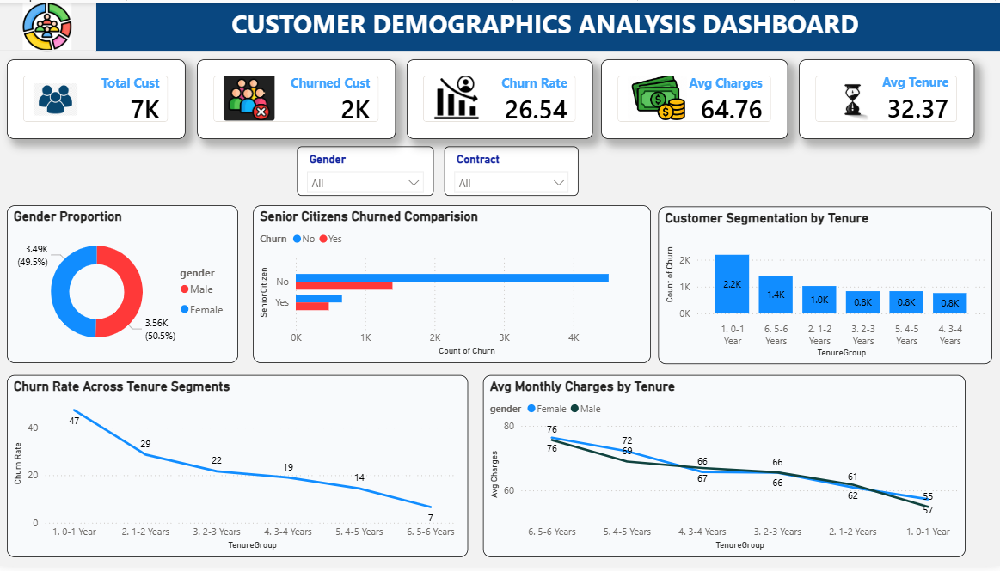
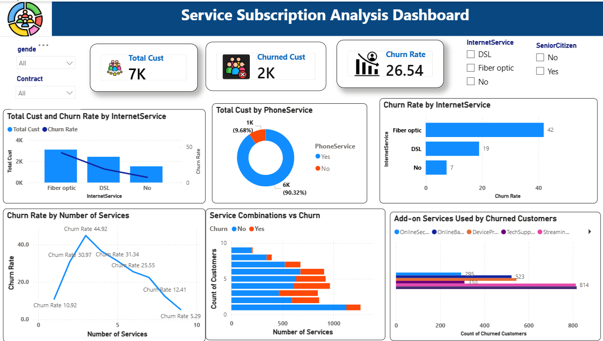
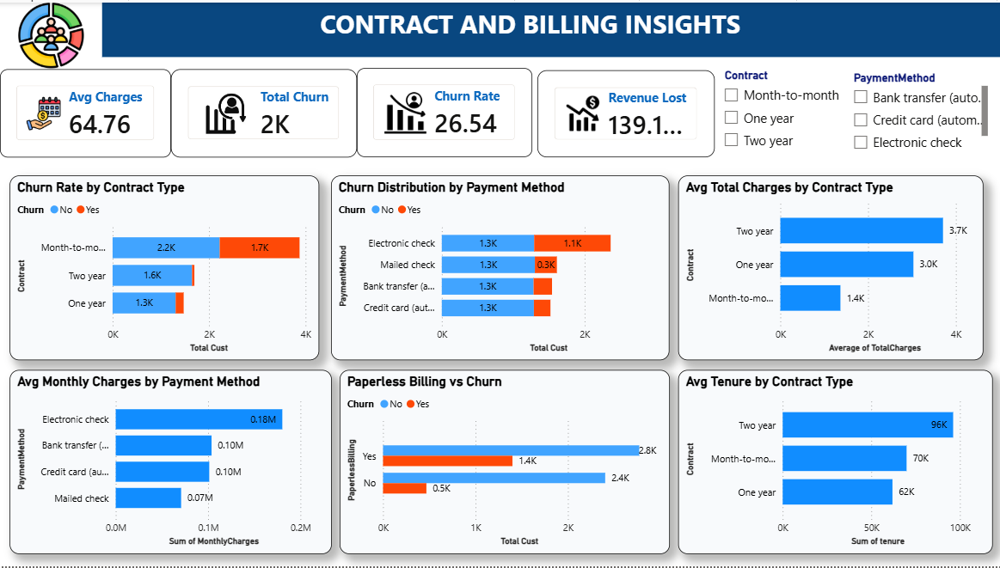
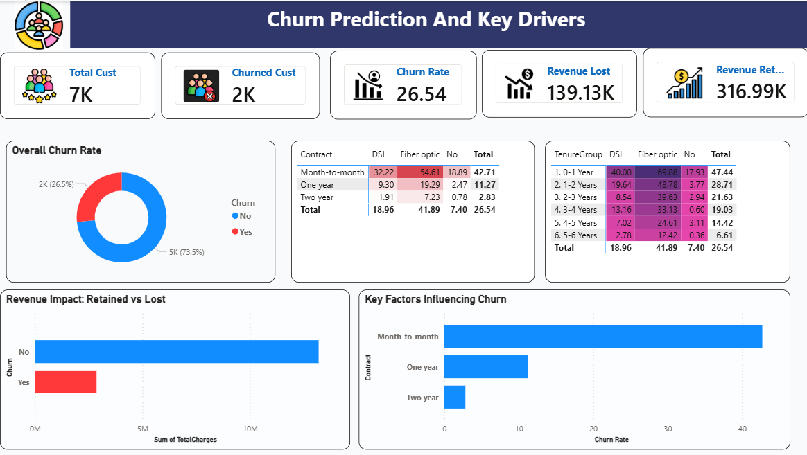

# 📊 Customer Churn Analysis & Prediction Dashboard

## 📌 Project Overview

Customer churn is one of the most critical challenges faced by subscription-based businesses. Understanding why customers leave and identifying the factors influencing churn can help organizations improve retention strategies and maximize revenue.

This Power BI project provides a comprehensive analysis of customer demographics, service subscriptions, contract details, billing behavior, and churn drivers. The dashboard enables stakeholders to monitor churn trends, identify high-risk customer segments, and make data-driven business decisions.

---

## 🎯 Business Problem

Customer retention is significantly more cost-effective than acquiring new customers. The objective of this project is to analyze customer behavior and identify patterns associated with customer churn.

The dashboard answers key business questions such as:

- Which customer segments are most likely to churn?
- How do demographics influence churn?
- Which services have the highest churn rates?
- How do contract types and payment methods impact customer retention?
- What are the key drivers contributing to customer churn?
- What is the revenue impact of customer attrition?

---

## 🛠 Tools & Technologies Used

- Power BI
- Power Query
- DAX
- Data Modeling
- Data Visualization
- Microsoft Excel (Dataset)

---

## 📂 Dataset Information

The dataset contains customer information including:

- Customer Demographics
- Gender
- Senior Citizen Status
- Tenure
- Internet Service Type
- Phone Service
- Contract Type
- Payment Method
- Monthly Charges
- Total Charges
- Churn Status

---

# 📈 Dashboard Pages

---

# 1️⃣ Customer Demographics Analysis

### Dashboard Preview



### Key Findings

**1. What is the proportion of male and female customers?**

* Male Customers: 50.5%
* Female Customers: 49.5%
* Customer distribution is nearly balanced across genders.

**2. How many senior citizens have churned compared to non-senior citizens?**

* Non-senior customers account for the majority of customers.
* Senior citizens show a relatively higher churn tendency compared to non-senior customers.

**3. How are customers segmented across different tenure ranges?**

* 0–1 Year: 2.2K customers
* 1–2 Years: 1.0K customers
* 2–3 Years: 0.8K customers
* 3–4 Years: 0.8K customers
* 4–5 Years: 0.8K customers
* 5–6 Years: 1.4K customers

**4. How does the churn rate differ across tenure segments?**

* 0–1 Year: 47%
* 1–2 Years: 29%
* 2–3 Years: 22%
* 3–4 Years: 19%
* 4–5 Years: 14%
* 5–6 Years: 7%

**5. Key Customer Metrics**

* Total Customers: 7K
* Churned Customers: 2K
* Churn Rate: 26.54%
* Average Monthly Charges: $64.76
* Average Tenure: 32.37 Months

---

# 2️⃣ Service Subscription Analysis

### Dashboard Preview



### Key Findings

**1. How many customers are subscribed to phone service?**

* 6K customers (90.32%) use Phone Service.
* 1K customers (9.68%) do not use Phone Service.

**2. What is the churn rate across internet service types?**

* Fiber Optic: 42%
* DSL: 19%
* No Internet: 7%

**3. Which add-on services are most commonly used by churned customers?**

* Streaming Services
* Online Backup
* Online Security
* Tech Support

**4. Is there a correlation between the number of subscribed services and churn?**

* Customers with fewer services show higher churn risk.
* Customers using multiple services demonstrate stronger retention.

**5. Service Usage Insights**

* Phone service adoption exceeds 90%.
* Service bundles improve customer retention.
* Fiber Optic customers have the highest churn rate.


---

# 3️⃣ Contract & Billing Insights

### Dashboard Preview



### Key Findings

**1. How does churn rate differ by contract type?**

* Month-to-Month: 42.71%
* One-Year: 11.27%
* Two-Year: 2.83%

**2. What is the distribution of churn across payment methods?**

* Electronic Check customers show the highest churn volume.
* Automatic payment methods show lower churn levels.

**3. What is the average total charge by contract type?**

* Two-Year Contract: Highest average total charges.
* One-Year Contract: Moderate average charges.
* Month-to-Month Contract: Lowest average charges.

**4. Is there a relationship between paperless billing and churn?**

* Paperless billing customers exhibit higher churn volume than non-paperless billing customers.

**5. Billing Metrics**

* Average Charges: $64.76
* Total Churn: 2K
* Churn Rate: 26.54%
* Revenue Lost: $139K+

---


---

# 4️⃣ Churn Prediction & Key Drivers

### Dashboard Preview



### Key Findings

**1. What is the overall customer churn rate?**

* Overall churn rate: 26.54%.

**2. Which customer segments are most likely to churn?**

* Month-to-month customers.
* Short-tenure customers.
* Fiber Optic users.
* Electronic Check users.

**3. What are the major churn drivers?**

* Month-to-month contracts.
* Short customer tenure.
* Fiber Optic internet service.
* Higher monthly charges.

**4. What is the revenue impact of churn?**

* Customer churn contributes to significant revenue loss.

### Key Insights

* Month-to-month contracts are the strongest churn driver.
* Fiber Optic customers are more likely to churn.
* Short-tenure customers have the highest churn risk.
* Retention initiatives should focus on high-risk customer groups.

---

## 📊 Dashboard Features

✔ Interactive Filters

- Gender
- Contract Type
- Internet Service Type
- Senior Citizen Status
- Payment Method

✔ Dynamic KPIs

✔ Drill-Down Analysis

✔ Customer Segmentation

✔ Churn Driver Identification

✔ Revenue Impact Analysis

---

## 💡 Business Recommendations

### Customer Retention

- Target new customers during their first year with retention programs.
- Provide loyalty incentives for long-tenure customers.
- Develop proactive churn prevention strategies for high-risk groups.

### Contract Optimization

- Encourage customers to switch from month-to-month plans to annual contracts.
- Offer discounts for long-term commitments.

### Service Enhancement

- Investigate service quality issues among Fiber Optic customers.
- Bundle popular add-on services to improve customer engagement.

### Revenue Protection

- Identify high-value customers at risk of churn.
- Deploy personalized retention campaigns.

---


---

## 📁 Project Structure

```text
Customer-Churn-Analysis/
│
├── Dataset/
│   └── customer_churn.csv
│
├── PowerBI/
│   └── Customer_Churn_Dashboard.pbix
│
├── Images/
│   ├── Page1.png
│   ├── Page2.png
│   ├── Page3.png
│   └── Page4.png
│
└── README.md
```

---

## 🚀 Outcomes

This dashboard helps stakeholders:

- Monitor customer churn trends.
- Identify high-risk customer groups.
- Understand revenue loss caused by churn.
- Improve retention strategies.
- Support data-driven business decisions.

---

## 👨‍💻 Author

**Aditya Thatha**

Aspiring Data Analyst

### Skills

- Python
- SQL
- Power BI
- Excel
- Exploratory Data Analysis (EDA)
- Data Visualization

📧 Email: adityathatha143@gmail.com

---

⭐ If you found this project useful, consider giving it a star on GitHub.
